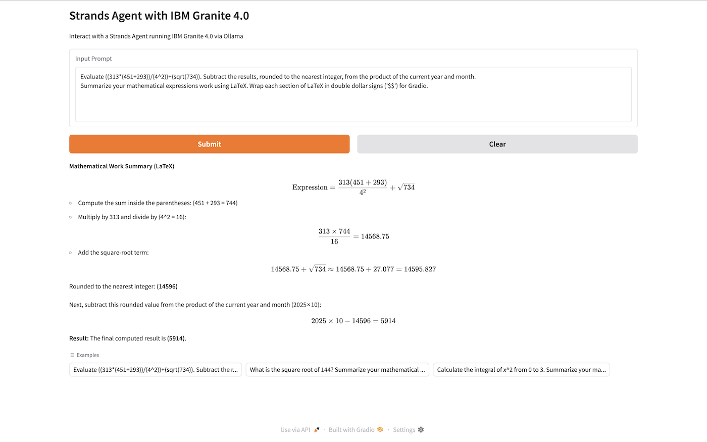

# Strands Agents, Ollama, and IBM Granite 4.0

Demonstration of Strands Agents tool calling capabilities with Ollama and IBM Granite 4.0 SML.



## Installation

### Prerequisites

- [Python 3.13+](https://www.python.org/downloads/)
- [UV](https://docs.astral.sh/uv/)
- [Make](https://www.gnu.org/software/make/)

### Setup Python Environment

The project includes a Makefile with common development commands:

```bash
# Install UV if you don't have it
python -m pip install uv --break-system-packages -Uq
```

Format and Lint Code

```bash
# Format code
make format

# Run linting
make lint

# Clean up temporary files
make clean
```

Create and activate virtual environment

```bash
make venv
make source

# Install dependencies
make install

# Optional: Upgrade dependencies
make upgrade
```

## Running the Application

```bash
make run
```

## Code Quality Tools

The project is configured with several code quality tools:

- **Black** - Code formatting
- **isort** - Import sorting
- **flake8** - Linting
- **mypy** - Type checking

Configuration files are provided for all these tools:

- `.flake8` - Flake8 configuration
- `setup.cfg` - isort, mypy, and pytest configuration
- `pyproject.toml` - Black configuration